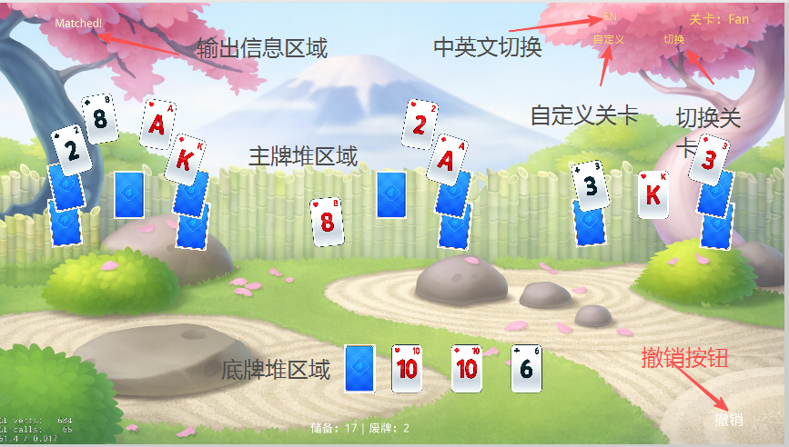
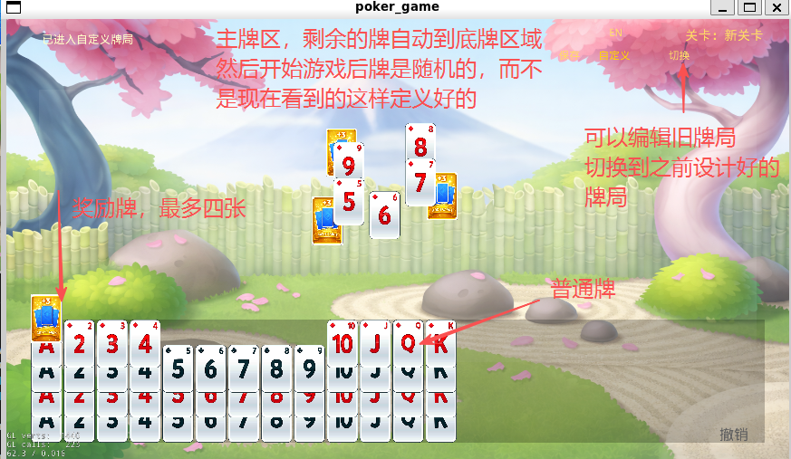

# Poker Game — 纸牌消除游戏

基于 Cocos2d-x 3.17.2 的纸牌消除游戏，C++17 编写。

## 玩法介绍

主牌区的牌按布局排列、层层覆盖，玩家需要通过**匹配消除**清空所有主牌。

### 核心规则

- **匹配消除**：双击或拖动主牌区翻开的牌，若与开放顶牌点数差为 1（可配置）即可消除
- **抽牌**：点击底牌堆抽一张新顶牌
- **回收**：底牌耗尽后可将废牌堆洗牌回底牌堆
- **撤销**：随时撤回上一步操作
- **奖励牌**：部分布局含奖励牌槽位，消除奖励牌会额外将 3 张底牌加入储备堆

### 难度选择

| 难度 | 开放顶牌数 | 说明 |
|------|-----------|------|
| 困难 | 1 | 只有一张顶牌可供匹配，容错最低 |
| 普通 | 2 | 两张顶牌，匹配机会适中 |
| 简单 | 3 | 三张顶牌，更容易找到可匹配的牌 |

### 内置布局

| 布局 | 牌堆数 | 卡槽数 | 说明 |
|------|--------|--------|------|
| TriPeaks | 3 | 28 | 三峰金字塔，经典布局 |
| Fan | 3 | 10 | 扇形展开，带旋转角度 |
| Diamond | 2 | 15 | 菱形对称排列 |
| Spiral | 2 | 21 | 螺旋形环绕 |

支持自定义布局编辑器，拖拽即可创建并保存新布局。

## 界面介绍

### 主界面（游戏进行中）



| 区域 | 说明 |
|------|------|
| **输出信息区域** | 左上角显示操作反馈（匹配成功/失败、翻牌、回收等） |
| **主牌堆区域** | 中央核心区域，牌按布局排列并层层覆盖，翻开顶部的牌可参与匹配 |
| **底牌堆区域** | 下方显示储备堆与废牌堆数量，点击可抽牌或回收 |
| **撤销按钮** | 右下角撤销按钮，撤回上一步操作 |
| **关卡显示** | 右上角显示当前布局名称（如 Fan） |
| **切换按钮** | 切换到下一关卡的布局 |
| **自定义按钮** | 进入自定义布局编辑模式 |
| **中英文切换** | 运行时一键切换界面语言 |

### 自定义编辑模式



进入自定义模式后：

- **主牌区**：剩余未放置的卡牌自动归入底牌堆，开始游戏后发牌随机
- **奖励牌**：金色卡牌，最多四张，消除时额外补充底牌
- **普通牌**：白色标准扑克牌
- **可以编辑旧牌局**：在编辑模式下拖拽调整位置，保存为新布局；也可切换回之前设计好的内置布局

## 项目结构

```
poker_game/
├── Classes/                  # C++ 源码
│   ├── AppDelegate.h/.cpp    # 应用入口，FPS/帧率由配置控制
│   ├── CardTypes.h           # 花色/点数枚举定义
│   ├── PokerCard.h/.cpp      # 扑克牌数据模型
│   ├── GameScene.h/.cpp      # 主场景（组合各子模块）
│   ├── model/                # 数据模型层
│   │   ├── GameState         # 牌局状态、发牌逻辑、明牌窗口
│   │   ├── CardDeck          # 牌堆创建与洗牌
│   │   ├── CardSlot          # 卡槽（含覆盖关系）
│   │   └── LayoutConfig      # 布局加载与解析
│   ├── controller/           # 控制器层
│   │   ├── GameController    # 操作入口（匹配/抽牌/撤销/回收）
│   │   ├── MatchEngine       # 匹配规则判定
│   │   └── UndoManager       # 撤销历史管理
│   ├── presenter/            # 表现层
│   │   ├── GameplayPresenter # 游戏动画编排、输入锁、状态同步
│   │   └── SceneChromePresenter # UI 菜单/覆盖层/难度选择
│   ├── view/                 # 视图层
│   │   ├── PokerCardView     # 单张卡牌渲染
│   │   ├── CardSlotView      # 卡槽容器
│   │   ├── MainAreaView      # 主牌区
│   │   └── TopAreaView       # 顶部牌区（底牌堆/开放牌/回收）
│   ├── config/               # 配置系统
│   │   ├── JsonConfig        # JSON 解析工具
│   │   └── GlobalConfig      # 全局配置单例
│   ├── editor/               # 自定义布局编辑器
│   ├── history/              # 操作历史记录
│   └── logging/              # 日志系统
├── Resources/
│   ├── config/               # 配置文件
│   │   ├── game_config.json  # 游戏规则/动画/UI/交互参数
│   │   ├── theme.json        # 字体/颜色/对话框/编辑器/图片
│   │   └── strings.json      # 多语言文案（en/zh）
│   ├── config/layouts/       # 布局模板 JSON
│   ├── fonts/
│   └── res/                  # 图片资源
├── docs/                     # 详细文档
└── docker/                   # Android 构建环境
```

## 架构

采用 **MVC + Presenter** 分层：

```
GameScene → GameplayPresenter → View + Controller → Model
```

| 层级 | 职责 |
|------|------|
| **Model** | 牌局状态、牌堆、卡槽、布局配置、覆盖关系 |
| **Controller** | 匹配规则判定、操作入口、撤销管理 |
| **Presenter** | 动画编排、输入锁、视图-模型状态同步 |
| **View** | 卡牌渲染、区域布局、交互反馈 |

## 配置系统

所有游戏参数均通过 JSON 配置外化，无需改代码即可调整：

| 配置文件 | 主要内容 |
|---------|---------|
| `game_config.json` | 窗口参数、卡牌尺寸比例、游戏规则（匹配点数差/奖励牌数/明牌范围）、交互参数、动画时长、UI 布局坐标 |
| `theme.json` | 字体与字号、颜色定义、对话框尺寸/坐标、编辑器参数、图片路径 |
| `strings.json` | 英文/中文双语文案，运行时可通过语言按钮切换 |

关键可配参数示例：
- `game.matchRankDiff` — 匹配点数差（默认 1）
- `game.rewardCardsPerBonus` — 每张奖励牌底牌数（默认 3）
- `game.visibleTopCardCountMin/Max` — 明牌窗口范围（默认 1~3）
- `animation.*` — 所有动画时长
- `colors.*` — 所有界面颜色

## 启动脚本

### `run_poker_game.sh`

一键构建并运行游戏：

```bash
./run_poker_game.sh
```

支持环境变量：
- `BUILD_TYPE` — 构建类型，默认 `Debug`
- `JOBS` — 并行编译数，默认 `nproc`

示例：

```bash
BUILD_TYPE=Release JOBS=8 ./run_poker_game.sh
```

脚本会自动执行 CMake 配置、编译、定位可执行文件并启动。

### `build_android_apk_docker.sh`

通过 Docker 构建 Android APK：

```bash
./build_android_apk_docker.sh
```

需要已安装 Docker 和 docker compose。构建成功后 APK 位于：
`poker_game/proj.android/app/build/outputs/apk`

### 手动构建

```bash
cmake -S poker_game -B poker_game/build
cmake --build poker_game/build -j4
```

## 详细文档

| 文档 | 说明 |
|------|------|
| [环境配置指南](poker_game/docs/setup.md) | 从零搭建开发环境（系统依赖、构建、运行、常见问题） |
| [架构设计](poker_game/docs/architecture.md) | 分层架构与数据流 |
| [数据模型层](poker_game/docs/model.md) | CardTypes / PokerCard / CardDeck / CardSlot / GameState / LayoutConfig |
| [控制器层](poker_game/docs/controller.md) | GameController / MatchEngine / UndoManager |
| [视图层](poker_game/docs/view.md) | 卡牌与区域视图 |
| [配置系统](poker_game/docs/config.md) | JSON 配置管理 |
| [布局系统](poker_game/docs/layouts.md) | 布局格式、动态覆盖、自定义编辑器 |
| [游戏规则](poker_game/docs/gameplay.md) | 匹配/抽牌/回收/撤销/拖放规则 |
| [构建与运行](poker_game/docs/building.md) | CMake 构建、Android 打包 |
